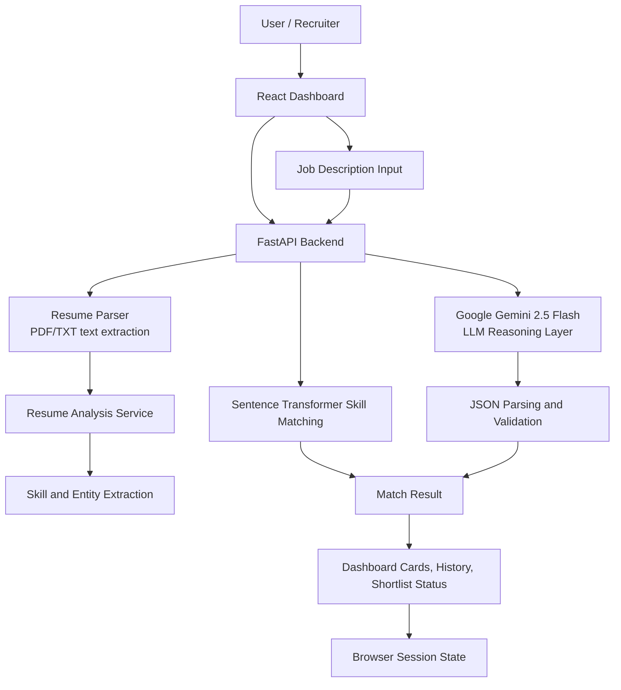
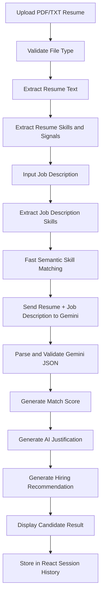
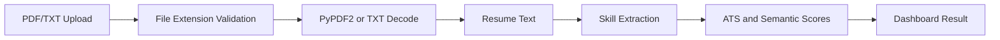
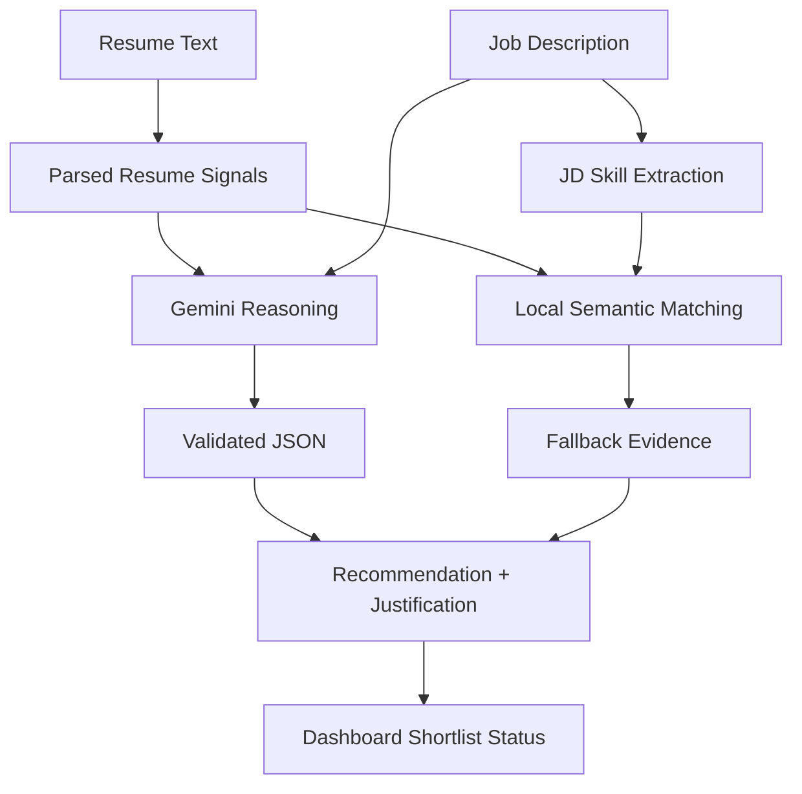
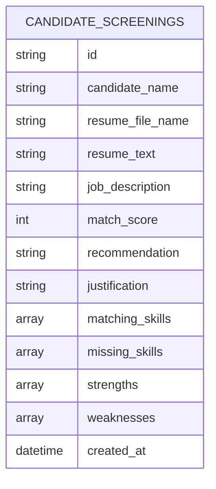

# Smart Resume Screener


Smart Resume Screener is an AI-powered resume screening system built with FastAPI and React. It parses PDF and TXT resumes, extracts candidate skills and resume signals, accepts a job description, performs fast semantic skill matching, and uses Google Gemini 2.5 Flash to generate an AI match score, hiring recommendation, missing skills, strengths, weaknesses, and recruiter-facing justification.

The project also contains workforce forecasting and skill analytics modules from the broader coursework. This README focuses on the implemented Smart Resume Screener flow while documenting every available API accurately.

## Objective

Develop an AI-powered Resume Screening System that:

- Parses PDF and text resumes.
- Extracts structured candidate information where supported by the parser.
- Accepts job descriptions from the dashboard or API.
- Uses Google Gemini 2.5 Flash for semantic resume-to-job analysis.
- Computes AI match scores.
- Generates hiring recommendations and detailed justifications.
- Displays shortlisted candidates in a React dashboard.

## Assignment Overview

| Requirement | Current Implementation Status |
| --- | --- |
| Resume upload | Implemented in React with PDF/TXT validation. |
| PDF parsing | Implemented with `PyPDF2`. |
| Text parsing | Implemented for `.txt` resume uploads. |
| Skills extraction | Implemented with rule-based normalization and local skill dictionaries. |
| Experience extraction | Partially implemented as years-of-experience detection from text patterns such as `3 years`. |
| Education extraction | Gemini returns `education_analysis`; no deterministic education parser field is currently implemented. |
| Certifications | Implemented through keyword matching against a configured certification list. |
| Projects | Gemini prompt asks for project analysis; deterministic project extraction is not currently implemented as a separate structured field. |
| Job description analysis | Implemented through `/extract-skills` and Gemini `/match-resume`. |
| Google Gemini integration | Implemented in `backend/services/llm_service.py`. |
| Semantic matching | Implemented with Sentence Transformers for skill similarity and Gemini for reasoning. |
| AI recommendation | Implemented through Gemini `recommendation` and dashboard fallback recommendations. |
| Candidate ranking | Implemented as session-level dashboard history with match scores and shortlist status. Persistent ranking is not implemented. |
| Database storage | No database client or MongoDB integration exists. Results are stored in React session state only. |
| REST APIs | Implemented with FastAPI. |
| React dashboard | Implemented in `frontend/skill-dashboard`. |

## Features

- Resume upload for `.pdf` and `.txt` files.
- Job description text area and TXT job description upload.
- Resume text extraction from PDF and TXT files.
- Skill extraction from resumes and job descriptions.
- ATS-style scoring using keyword, formatting, recruiter compatibility, and semantic signals.
- Sentence Transformer-based skill matching through the existing recommendation service.
- Gemini-powered resume-to-job comparison.
- AI match score, matching skills, missing skills, strengths, weaknesses, recommendation, and justification.
- Shortlisted candidate count, average score, recent uploads, searchable history, and candidate detail view.
- Optional workforce analytics and forecasting APIs retained from the broader project.

## Technology Stack

| Layer | Technologies |
| --- | --- |
| Frontend | React 19, Vite, Tailwind CSS, Lucide React |
| Backend API | FastAPI, Pydantic, Uvicorn |
| Resume Parsing | PyPDF2, Python text processing |
| NLP and Matching | Sentence Transformers, Transformers, Torch, scikit-learn, spaCy dependency |
| LLM | Google Gemini 2.5 Flash via REST API using `requests` |
| Data Processing | Pandas, NumPy |
| Forecasting Modules | TensorFlow, Prophet, statsmodels, SHAP |
| Storage | React session state for screening results; CSV files for local datasets |

## Project Architecture



Note: the architecture currently uses browser session state for screening results. No database persistence layer is implemented.

## Workflow



## Folder Structure

Generated from the repository source tree, excluding dependency folders such as `node_modules`, virtual environments, caches, and generated build output.

```text
Smart-Resume-Screener/
  .env.example
  .gitignore
  DATASET.md
  FORECASTING_EXPLAINABILITY.md
  MODELS.md
  PROJECT_DOCUMENTATION.md
  README.md
  REPORT.md
  backend/
    README.md
    requirements.txt
    analysis/
      load_dataset.py
      skill_analysis.py
    api/
      main.py
    dashboard/
      app.py
    data/
      processed/
        clean_workforce_forecasting_dataset.csv
        enterprise_workforce_dataset.csv
        final_skill_forecast_dataset.csv
        jobs_with_skills.csv
      raw/
        future_jobs_dataset.csv
        job_trend.csv
        jobs_dataset.csv
    models/
      arima_model.py
      lstm_model.py
      forecasting/
        .gitkeep
    nlp/
      skill_extraction.py
    preprocessing/
      __init__.py
      build_skill_forecast_dataset.py
      enterprise_workforce_preprocessing.py
      unified_workforce_preprocessing.py
    scraper/
      job_scraper.py
    services/
      __init__.py
      career_service.py
      config.py
      forecast_service.py
      llm_service.py
      model_loader.py
      nlp_service.py
      recommendation_service.py
      resume_service.py
      skill_extraction_service.py
    utils/
      helper.py
  frontend/
    skill-dashboard/
      index.html
      package.json
      package-lock.json
      postcss.config.js
      tailwind.config.js
      vite.config.js
      eslint.config.js
      README.md
      public/
        vite.svg
      src/
        App.css
        App.jsx
        index.css
        main.jsx
        assets/
          react.svg
        components/
          ForecastExplainabilityPanel.jsx
          ForecastPanel.jsx
          GeographicWorkforcePanel.jsx
          JobTable.jsx
          Navbar.jsx
          ResumeAnalyzer.jsx
          Sidebar.jsx
          SkillChart.jsx
          SkillTrendChart.jsx
          StatCard.jsx
        data/
          skillsData.js
        pages/
          Dashboard.jsx
        services/
          apiService.js
        utils/
          forecastInterpretation.js
```

## Installation Guide

### Backend

```bash
cd backend
python -m venv .venv
.venv\Scripts\activate
pip install -r requirements.txt
```

### Frontend

```bash
cd frontend/skill-dashboard
npm install
```

## Environment Variables

Create a `.env` file in the repository root. Do not commit `.env`.

| Variable | Required | Used By | Description |
| --- | --- | --- | --- |
| `VITE_API_BASE_URL` | Recommended | Frontend | Backend base URL. Defaults to `http://127.0.0.1:8000` in `apiService.js` if unset. |
| `BACKEND_CORS_ORIGINS` | Recommended | Backend | Comma-separated allowed frontend origins. Defaults to `http://localhost:5173`. |
| `MODEL_DIR` | Optional | Backend | Overrides local model directory. |
| `HF_MODEL_DIR` | Optional | Backend | Overrides Hugging Face model cache directory. |
| `FORECAST_MODEL_PATH` | Optional | Backend | Overrides forecasting model path. |
| `GEMINI_API_KEY` | Required for LLM matching | Backend | Google Gemini API key. Must remain secret. |
| `GEMINI_MODEL` | Optional | Backend | Defaults to `gemini-2.5-flash`. |
| `GEMINI_API_TIMEOUT` | Optional | Backend | Gemini request timeout in seconds. Defaults to `30`. |

Example:

```env
VITE_API_BASE_URL=http://127.0.0.1:8000
BACKEND_CORS_ORIGINS=http://localhost:5173
MODEL_DIR=backend/models
HF_MODEL_DIR=backend/models/huggingface
FORECAST_MODEL_PATH=backend/models/forecasting/modelnew.h5
GEMINI_API_KEY=
GEMINI_MODEL=gemini-2.5-flash
GEMINI_API_TIMEOUT=30
```

No `MONGODB_URI`, `JWT_SECRET`, or authentication variables are currently used by the codebase.

## Running the Project

Start the backend:

```bash
cd backend
uvicorn api.main:app --reload
```

Start the frontend:

```bash
cd frontend/skill-dashboard
npm run dev
```

Open the Vite URL, usually:

```text
http://localhost:5173
```

Optional Streamlit dashboard utility:

```bash
cd backend
streamlit run dashboard/app.py
```

## API Documentation

Base URL for local development:

```text
http://127.0.0.1:8000
```

| Method | Endpoint | Request | Response | Description |
| --- | --- | --- | --- | --- |
| `GET` | `/` | None | `{ "message": "Computational Workforce Intelligence API Running" }` | Health/root route. |
| `GET` | `/skills` | None | Skill summary object/list from CSV analysis | Returns skill counts and summary data from local datasets. |
| `GET` | `/top-jobs` | None | Top jobs data | Returns top job records from local dataset analysis. |
| `GET` | `/skill-trends` | None | Trend data | Returns skill trend data from local CSV analysis. |
| `POST` | `/analyze-resume` | Multipart form field `file` with `.pdf` or `.txt` | Resume analysis JSON | Extracts resume text, skills, scoring signals, recommendations, and returns `resume_text` for LLM matching. |
| `POST` | `/match-resume` | JSON with `resume_text`, `job_description` | Gemini match JSON | Uses Gemini 2.5 Flash for resume-to-job matching. |
| `POST` | `/extract-skills` | `{ "text": "..." }` | `{ "skills": [...] }` | Extracts normalized skills from arbitrary text. |
| `POST` | `/match-skills` | `{ "resume_skills": [...], "market_skills": [...], "top_k": 10 }` | Skill match/recommendation object | Uses local semantic matching and recommendation logic. |
| `POST` | `/career-intelligence` | `{ "skills": [...], "text": "..." }` | Career intelligence object | Produces skill gap analysis, learning roadmap, and career signals. |
| `GET` | `/forecast-skills` | Query: `months`, optional `skills` | Forecast object | Returns skill demand forecasts from artifacts or CSV fallback. |
| `POST` | `/predict-demand` | `{ "skill": "python", "months": 6 }` | Skill demand forecast object | Forecasts demand for a single skill. |
| `GET` | `/workforce-analytics` | None | Workforce analytics object | Returns dataset-based workforce analytics. |
| `GET` | `/dataset-insights` | None | Dataset insight object | Returns dataset source and preprocessing insight. |
| `GET` | `/model-explainability` | None | Explainability object | Returns forecasting model metadata and explainability fields when artifacts exist. |
| `GET` | `/live-jobs` | None | Live-style job list from local data | Returns job records generated from dataset analysis. |

### `/match-resume` Example

Request:

```json
{
  "resume_text": "Python developer with FastAPI, React, AWS, SQL, and machine learning projects.",
  "job_description": "We need a full-stack AI engineer with Python, React, cloud deployment, APIs, and MLOps exposure."
}
```

Response shape:

```json
{
  "match_score": 92,
  "matching_skills": ["Python", "React", "FastAPI", "AWS"],
  "missing_skills": ["MLOps", "model monitoring"],
  "experience_analysis": "The resume demonstrates relevant full-stack and AI project experience.",
  "education_analysis": "Education details are acceptable or require recruiter review depending on the resume text.",
  "strengths": ["Strong backend alignment", "Relevant cloud exposure"],
  "weaknesses": ["Limited explicit MLOps evidence"],
  "recommendation": "Hire",
  "justification": "The candidate strongly matches the core stack and project expectations, with minor production ML gaps."
}
```

## Resume Parsing Pipeline



Implemented parsing details:

- PDF text extraction uses `PyPDF2.PdfReader`.
- TXT parsing decodes with `utf-8`, `utf-16`, then `latin-1`, with a final fallback decode.
- Empty extracted text returns a user-facing error.
- Invalid PDFs return a clear upload error.
- Skills are normalized with aliases and configured technical skill dictionaries.
- Certifications are detected through keyword matching.
- Years of experience are detected from text patterns such as `2 years` or `5+ yrs`.

Current limitations:

- Candidate name, full education objects, detailed work history, and project lists are not deterministically parsed into dedicated structured fields.
- Gemini can analyze education, experience, and projects semantically from text, but this is separate from deterministic extraction.

## Google Gemini LLM Integration

Gemini is integrated in `backend/services/llm_service.py`.

### Why Gemini Was Selected

- It provides a capable LLM reasoning layer for comparing a free-form resume with a free-form job description.
- It can evaluate context that keyword matching misses, such as related skills, project relevance, and suitability.
- Gemini 2.5 Flash is suitable for low-latency screening workflows where recruiters need quick summaries.

### Why an LLM Is Required

The existing local matching can compare skills quickly, but recruitment decisions also require semantic judgment:

- whether experience is relevant to the role,
- whether projects demonstrate practical ability,
- whether missing skills are critical or minor,
- whether education and certifications support the role,
- how to explain a recommendation clearly.

### Request Flow

1. React uploads and analyzes the resume through `/analyze-resume`.
2. React extracts job description skills through `/extract-skills`.
3. React calls `/match-skills` for fast local semantic matching.
4. React calls `/match-resume` with `resume_text` and `job_description`.
5. FastAPI sends a prompt to Gemini using the configured API key.
6. Gemini returns JSON text.
7. The backend parses and validates the JSON before returning it to the frontend.

### Response Flow

The validated Gemini response is merged into the dashboard result. The dashboard prioritizes Gemini fields for:

- `match_score`
- `matching_skills`
- `missing_skills`
- `strengths`
- `weaknesses`
- `experience_analysis`
- `education_analysis`
- `recommendation`
- `justification`

### JSON Parsing

The service requests JSON output with:

```json
{
  "generationConfig": {
    "temperature": 0.2,
    "responseMimeType": "application/json"
  }
}
```

It still defensively handles fenced JSON or extra text by extracting the first JSON object and validating the required schema.

### Error Handling

Gemini-specific errors are converted to API responses:

- missing `GEMINI_API_KEY`: `503`
- empty resume or job description: `400`
- timeout: `504`
- rate limit: `429`
- Gemini API failure: `502` or `503`
- invalid JSON response: `502`

### Retry Strategy

Automatic retry is not currently implemented. The service uses a configurable timeout and returns a clear error for the frontend to display.

### Fallback Strategy

The React dashboard catches Gemini failures and continues to show parser, ATS, and local semantic matching results. This keeps the screening workflow usable even when the LLM is unavailable.

## Prompt Engineering

The application uses this prompt in `backend/services/llm_service.py`:

````text
You are an expert AI recruitment assistant.

Compare the following resume with the provided job description.

Analyze:

* Technical Skills
* Soft Skills
* Experience
* Education
* Certifications
* Projects
* Missing Skills
* Overall Suitability

Return ONLY valid JSON.

```json
{
  "match_score": 0,
  "matching_skills": [],
  "missing_skills": [],
  "experience_analysis": "",
  "education_analysis": "",
  "strengths": [],
  "weaknesses": [],
  "recommendation": "",
  "justification": ""
}
```

Resume:
{resume_text}

Job Description:
{job_description}
````

This prompt improves semantic matching by forcing the model to evaluate multiple hiring dimensions and return a machine-readable JSON object instead of unstructured prose. The backend then validates that object before the dashboard uses it.

## Candidate Scoring Logic

The project currently has multiple scoring paths.

### Resume Analysis Scores

`backend/services/resume_service.py` computes:

- `keyword_optimization_score`: resume keyword, action verb, metric, and skill evidence.
- `formatting_quality_score`: section coverage, length, contact signal, and noise penalty.
- `recruiter_compatibility_score`: detected skills, soft skills, and certifications.
- `semantic_match_score`: local skill similarity against known technical skills.
- `ats_score`: weighted blend of keyword, formatting, recruiter, and semantic scores.
- `industry_alignment_score`: role-profile alignment plus semantic score.
- `future_employability_score`: workforce demand and market competitiveness blend.
- `resume_strength_score`: ATS, employability, recruiter compatibility, stack maturity, and project complexity blend.

### Skill Matching Scores

`backend/services/recommendation_service.py` recommends missing skills using:

- current resume skills,
- role cluster adjacency,
- local semantic similarity,
- workforce demand signals from CSV data where available.

### Gemini Match Score

`/match-resume` returns Gemini's `match_score` as the primary resume-to-job score in the dashboard when available. The backend clamps this score to the `0-100` range.

### Dashboard Fallback Order

The displayed match score uses:

1. Gemini `match_score` when available.
2. Resume `semantic_match_score` when Gemini is unavailable.
3. Resume `ats_score` when semantic score is unavailable.
4. Average local `/match-skills` score as a final fallback.

### Final Recommendation

The dashboard uses Gemini `recommendation` when available. If Gemini is unavailable, it falls back to a simple threshold:

- `>= 75`: `Shortlisted`
- `< 75`: `Review`

## AI Recommendation Process



The AI recommendation is based on Gemini's structured comparison of resume text and job description text. The dashboard combines that output with local parsing and matching results for display.

## Database Design

No MongoDB, SQL database, ORM, or database client is currently implemented in this repository.

Current storage mechanism:

- Screening results are stored in React component state in `frontend/skill-dashboard/src/pages/Dashboard.jsx`.
- Data disappears when the browser session refreshes.
- Local CSV datasets support skill analytics and forecasting modules, but they are not candidate result storage.

Recommended future schema:



Suggested MongoDB document:

```json
{
  "candidate_name": "Candidate Name",
  "resume_file_name": "resume.pdf",
  "resume_text": "...",
  "job_description": "...",
  "match_score": 92,
  "recommendation": "Hire",
  "justification": "...",
  "matching_skills": ["Python", "React"],
  "missing_skills": ["Kubernetes"],
  "strengths": ["Relevant API experience"],
  "weaknesses": ["Limited deployment evidence"],
  "created_at": "2026-07-15T00:00:00Z"
}
```

## Dashboard Overview

Implemented dashboard sections:

- Hero summary with active candidate status.
- Total uploaded resumes.
- Processed resumes.
- Shortlisted candidates.
- Average match score.
- Recent uploads.
- Recent analysis decisions.
- Resume and job description matching panel.
- Candidate card with score, rating, experience, education, and top skills.
- LLM matching panel with strengths, weaknesses, matched skills, missing skills, justification, and recommendation.
- Searchable/filterable resume history.
- Candidate report drawer/section with resume summary, JD summary, comparison, justification, and recommendation.

## Screenshots

Add screenshots after running the local dashboard.

| Screen | Placeholder |
| --- | --- |
| Dashboard | `docs/screenshots/dashboard.png` |
| Resume Upload | `docs/screenshots/resume-upload.png` |
| Job Description | `docs/screenshots/job-description.png` |
| Resume Analysis | `docs/screenshots/resume-analysis.png` |
| Match Score | `docs/screenshots/match-score.png` |
| Candidate Recommendation | `docs/screenshots/candidate-recommendation.png` |
| Database | Not applicable currently because database persistence is not implemented. |

## Security

Implemented or configured security practices:

- Gemini API key is loaded from environment variables through `services/config.py`.
- `.env` is ignored by Git.
- `.env.example` documents required variables without secrets.
- FastAPI validates request bodies with Pydantic models.
- Resume upload endpoint accepts only `.pdf` and `.txt` extensions.
- Invalid or unreadable PDFs return a controlled error.
- Empty resume text and empty job descriptions are rejected for LLM matching.
- CORS origins are configurable with `BACKEND_CORS_ORIGINS`.
- Gemini error messages are normalized before reaching the frontend.

Current security limitations:

- No authentication or authorization is implemented.
- Uploaded resume files are processed in memory and are not persisted by the backend.
- File size limits are not explicitly enforced in the API.
- No virus scanning or sandboxed document parsing is implemented.

## Error Handling

| Scenario | Handling |
| --- | --- |
| Missing resume file | Frontend displays upload-required message. |
| Empty job description | Frontend blocks analysis and displays a message. |
| Unsupported resume type | Backend returns `400`; frontend also validates PDF/TXT. |
| Invalid PDF | Backend returns clear `400` error. |
| Empty extracted resume text | Backend returns clear `400` error. |
| Gemini API key missing | Backend returns `503`. |
| Gemini timeout | Backend returns `504`. |
| Gemini rate limit | Backend returns `429`. |
| Gemini invalid JSON | Backend returns `502`. |
| Gemini unavailable | Frontend displays warning and falls back to local parser/semantic results. |

## Performance Optimizations

- Modular services separate parsing, skill extraction, matching, LLM calls, and forecasting.
- Local Sentence Transformer matching keeps skill similarity fast and available without an LLM call.
- Gemini uses low temperature and JSON response mode for predictable responses.
- Gemini calls use a configurable timeout.
- Resume analysis and job description skill extraction are performed before LLM matching, so the UI can still show useful results if Gemini fails.
- Forecasting services use saved artifacts or CSV fallback paths where available.

## Challenges Faced

- Combining deterministic resume parsing with free-form resume formats.
- Keeping Gemini output machine-readable enough for dashboard rendering.
- Avoiding hardcoded API keys while still making setup simple.
- Preserving existing semantic matching and forecasting modules while adding LLM-based reasoning.
- Clearly separating implemented features from future database and authentication work.

## Future Improvements

- Add MongoDB or PostgreSQL persistence for screening results.
- Add candidate ranking sorted by score across persisted screenings.
- Add authentication and role-based recruiter access.
- Add explicit file size limits and document scanning.
- Add deterministic extraction for candidate name, education, work experience, and projects.
- Add retry with exponential backoff for transient Gemini failures.
- Add automated backend tests for parser, LLM validation, and API error cases.
- Add UI screenshots and a short demo video.
- Add export to CSV/PDF for screening reports.

## Evaluation Focus

| Area | How This Project Addresses It |
| --- | --- |
| Code Quality | Business logic is organized into services, API models, and React components. |
| Clean Architecture | Backend separates API routes, resume parsing, NLP, recommendation, LLM, career, and forecasting services. |
| Resume Parsing | PDF/TXT text extraction and skill/certification/year extraction are implemented. |
| Data Extraction | Skills, soft skills, certifications, years of experience, missing skills, strengths, and weaknesses are extracted or generated. |
| Google Gemini Integration | Dedicated Gemini service handles prompt construction, API call, JSON parsing, and validation. |
| Prompt Engineering | Prompt uses explicit recruiter role, analysis dimensions, and strict JSON schema. |
| Semantic Matching | Local Sentence Transformer matching is retained; Gemini adds contextual reasoning. |
| AI Decision Making | Gemini provides match score, suitability analysis, recommendation, and justification. |
| Output Clarity | Dashboard displays scores, matched skills, missing skills, justifications, recommendations, and history. |
| Maintainability | Environment-driven configuration and service-layer organization make the system easier to extend. |
| Scalability | Stateless backend endpoints can be extended with persistent storage and background jobs. |

## Deliverables

| Deliverable | Status |
| --- | --- |
| GitHub Repository | Repository structure is ready; confirm remote before submission. |
| Professional README | Implemented in this file. |
| Architecture Diagram | Included with Mermaid. |
| Workflow Diagram | Included with Mermaid. |
| API Documentation | Included. |
| Prompt Documentation | Included with exact prompt. |
| Screenshots | Placeholders included; images still need to be captured. |
| Demo Video | Not included in repository; recommended 2-3 minute walkthrough. |

## Author

Ayush

Project: Smart Resume Screener
