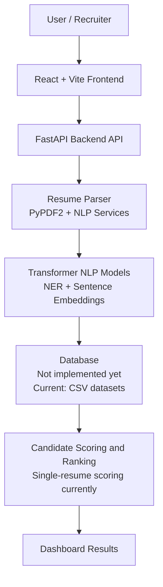
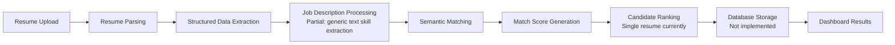

# Smart Resume Screener


## 1. Project Title

**Smart Resume Screener - AI Resume Intelligence and Skill Matching Dashboard**

## 2. Project Description

Smart Resume Screener is an AI-assisted resume analysis system that parses PDF resumes, extracts technical skills and candidate signals, computes ATS-style scores, performs semantic skill matching, and displays recommendations in a React dashboard.

The repository also includes workforce intelligence modules for skill-demand forecasting, salary signals, future-readiness scoring, market competitiveness, and career recommendations. These modules support the resume screener by comparing extracted skills against market-demand datasets.

## 3. Objective

The objective is to help reviewers evaluate candidate resumes faster by extracting resume content, identifying relevant skills, scoring resume quality, surfacing missing skills, and presenting clear recommendations through an interactive dashboard.

## 4. Assignment Overview

| Assignment Requirement | Current Implementation Status |
| --- | --- |
| Accept PDF/Text resume uploads | **Partially implemented**: PDF upload is implemented. Text input exists for skill extraction/matching, but not as a full resume upload workflow. |
| Accept a Job Description | **Partially implemented**: frontend text area accepts pasted text, but there is no dedicated job-description object or resume-vs-JD endpoint. |
| Parse resumes automatically | **Implemented for PDF** using `PyPDF2`. |
| Extract skills | **Implemented** using rules, aliases, Hugging Face NER fallback, and semantic normalization. |
| Extract experience | **Partially implemented**: years of experience are extracted from text patterns such as `3 years`. |
| Extract education | **Not implemented as a structured field**. Education section quality can influence formatting, but structured education extraction is not present. |
| Generate structured candidate data | **Implemented for single resume analysis response** with scores, skills, categories, recommendations, salary signals, role alignment, and roadmap. |
| Use an LLM for semantic matching | **Partially implemented**: uses transformer-based NER and `sentence-transformers` embeddings. It does not use a prompt-based generative LLM. |
| Generate a match score | **Implemented** as ATS score, semantic market match score, role alignment score, market competitiveness score, and related scoring fields. |
| Explain why candidate matches/does not match | **Partially implemented** through strengths, weaknesses, missing skills, role alignment, and recommendations. |
| Display shortlisted candidates | **Not implemented for multiple candidates**. The dashboard analyzes and scores one uploaded resume at a time. |
| Store parsed resume data in a database | **Not implemented**. The app is currently stateless and uses CSV datasets for market intelligence. |

## 5. Features

- PDF resume upload and parsing.
- Free-text skill extraction from pasted text.
- Technical skill detection with aliases and canonical skill normalization.
- Transformer-based NER support using `dslim/bert-base-NER`.
- Semantic skill matching using `sentence-transformers/all-MiniLM-L6-v2`.
- ATS-style scoring with keyword, formatting, recruiter compatibility, and semantic match components.
- Role alignment across implemented role profiles such as AI/ML Engineering, Cloud Data Engineering, Full Stack Engineering, and Business Intelligence.
- Missing-skill and recommended-skill generation.
- Resume strengths, resume weaknesses, and improvement suggestions.
- Salary intelligence and market competitiveness signals from local workforce datasets.
- React dashboard with charts, forecasting panels, workforce analytics, job table, and resume analyzer.
- FastAPI backend with documented API endpoints.

## 6. Scope of Work

The implemented scope is focused on **resume intelligence plus workforce skill analytics**.

| Area | Implemented |
| --- | --- |
| Resume parsing | PDF text extraction using `PyPDF2`. |
| Resume skill extraction | Dictionary matching, aliases, NER, and semantic normalization. |
| Candidate scoring | ATS, semantic market match, future readiness, resume strength, role alignment, and market competitiveness. |
| Resume-job semantic matching | Implemented as resume-skill-to-market-skill matching, not full resume-to-job-description matching. |
| Dashboard | Implemented in React with resume analysis and workforce analytics panels. |
| Database persistence | Not implemented. |
| Multi-candidate shortlisting | Not implemented. |

## 7. Technology Stack

| Layer | Technologies Actually Used |
| --- | --- |
| Frontend | React 19, Vite, Tailwind CSS, Chart.js, React Chart.js 2, Lucide React |
| Backend | FastAPI, Uvicorn, Pydantic |
| Resume parsing | PyPDF2 |
| AI / NLP | Hugging Face Transformers, Sentence Transformers, PyTorch, spaCy listed in requirements |
| Semantic matching | `sentence-transformers` embeddings and cosine similarity |
| Forecasting / ML | TensorFlow, scikit-learn, statsmodels, Prophet, SHAP |
| Data handling | pandas, NumPy, openpyxl |
| Storage | CSV files only; no database layer currently implemented |
| Dashboard utility | Streamlit backend dashboard file exists |

## 8. System Architecture



## 9. Workflow



Actual implemented flow:

1. User uploads a PDF resume from the React dashboard.
2. FastAPI receives the file through `/analyze-resume`.
3. `PyPDF2` extracts text from all PDF pages.
4. NLP services extract technical skills, soft skills, certifications, and years of experience.
5. Skills are normalized with aliases and canonical skill names.
6. Sentence embeddings compare resume skills against known market/technical skills.
7. Scoring logic generates ATS, semantic match, future readiness, role alignment, resume strength, and market competitiveness scores.
8. The dashboard displays detected skills, recommended skills, missing skills, strengths, weaknesses, roadmap, and salary intelligence.

## 10. Folder Structure

```text
.
├── backend/
│   ├── analysis/
│   │   ├── load_dataset.py
│   │   └── skill_analysis.py
│   ├── api/
│   │   └── main.py
│   ├── dashboard/
│   │   └── app.py
│   ├── data/
│   │   ├── processed/
│   │   └── raw/
│   ├── models/
│   │   ├── forecasting/
│   │   ├── arima_model.py
│   │   └── lstm_model.py
│   ├── nlp/
│   │   └── skill_extraction.py
│   ├── preprocessing/
│   ├── scraper/
│   ├── services/
│   ├── utils/
│   ├── README.md
│   └── requirements.txt
├── frontend/
│   └── skill-dashboard/
│       ├── public/
│       ├── src/
│       │   ├── assets/
│       │   ├── components/
│       │   ├── data/
│       │   ├── pages/
│       │   ├── services/
│       │   └── utils/
│       ├── package.json
│       └── vite.config.js
├── DATASET.md
├── MODELS.md
├── REPORT.md
├── PROJECT_DOCUMENTATION.md
├── FORECASTING_EXPLAINABILITY.md
├── .env.example
├── .gitignore
└── README.md
```

## 11. Installation Guide

### Backend

```bash
cd backend
python -m venv .venv
.venv\Scripts\activate
pip install -r requirements.txt
```

### Frontend

```bash
cd frontend/skill-dashboard
npm install
```

## 12. Environment Variables

Create a `.env` file from `.env.example`.

```env
VITE_API_BASE_URL=http://127.0.0.1:8000
BACKEND_CORS_ORIGINS=http://localhost:5173
MODEL_DIR=backend/models
HF_MODEL_DIR=backend/models/huggingface
FORECAST_MODEL_PATH=backend/models/forecasting/modelnew.h5
```

| Variable | Purpose |
| --- | --- |
| `VITE_API_BASE_URL` | Frontend API base URL. |
| `BACKEND_CORS_ORIGINS` | Allowed frontend origins for FastAPI CORS. |
| `MODEL_DIR` | Backend model artifact directory. |
| `HF_MODEL_DIR` | Local Hugging Face model cache directory. |
| `FORECAST_MODEL_PATH` | Optional trained forecasting model path. |

## 13. Running the Project

Start the backend:

```bash
cd backend
uvicorn api.main:app --reload
```

Start the frontend:

```bash
cd frontend/skill-dashboard
npm run dev
```

Optional Streamlit dashboard:

```bash
cd backend
streamlit run dashboard/app.py
```

## 14. API Endpoints

| Method | Endpoint | Description |
| --- | --- | --- |
| `GET` | `/` | Health/root message for the API. |
| `GET` | `/skills` | Returns skill summary analytics from local datasets. |
| `GET` | `/top-jobs` | Returns top job/role analytics. |
| `GET` | `/skill-trends` | Returns skill trend data. |
| `POST` | `/analyze-resume` | Accepts a PDF resume and returns ATS/resume intelligence analysis. |
| `POST` | `/extract-skills` | Extracts skills from pasted text. |
| `POST` | `/match-skills` | Matches resume skills against market skills and returns recommended skill gaps. |
| `POST` | `/career-intelligence` | Builds career recommendations from skills and optional text. |
| `GET` | `/forecast-skills` | Returns skill demand forecasts for selected skills/months. |
| `POST` | `/predict-demand` | Predicts demand for a specific skill and forecast horizon. |
| `GET` | `/workforce-analytics` | Returns workforce analytics summary. |
| `GET` | `/dataset-insights` | Returns dataset-level insights. |
| `GET` | `/model-explainability` | Returns model explainability artifacts if available. |
| `GET` | `/live-jobs` | Returns live job data through the scraper/analysis service. |

## 15. Database Design

**Current status: no database is implemented.**

The application currently:

- Reads local CSV datasets from `backend/data/raw` and `backend/data/processed`.
- Returns parsed resume analysis directly from the API response.
- Does not persist uploaded resumes, parsed candidate records, job descriptions, or match history.

Recommended future database tables, if persistence is added:

| Table | Purpose |
| --- | --- |
| `candidates` | Candidate profile and contact metadata. |
| `resumes` | Uploaded resume metadata, extracted text, parse status. |
| `job_descriptions` | Job description text and extracted required skills. |
| `resume_matches` | Resume-to-JD score, matching skills, missing skills, explanation, recommendation. |
| `skills` | Normalized skill dictionary and aliases. |

## 16. Resume Parsing Process

Implemented in `backend/services/resume_service.py` and `backend/services/nlp_service.py`.

1. PDF file is validated by extension in `/analyze-resume`.
2. `PyPDF2.PdfReader` extracts text from each page.
3. Rule-based matching detects known technical skills.
4. Skill aliases normalize terms such as `js` to `javascript`, `nodejs` to `node.js`, and `k8s` to `kubernetes`.
5. Hugging Face NER is attempted for additional entity extraction.
6. Candidate signals are derived:
   - technical skills
   - soft skills
   - certifications
   - years of experience
   - role alignment
   - strengths and weaknesses
   - missing skills

Structured education extraction is not currently implemented.

## 17. LLM Semantic Matching

This project does **not** currently use a prompt-based generative LLM such as GPT to compare a resume with a job description.

Implemented semantic matching uses transformer models:

- `dslim/bert-base-NER` for named-entity recognition.
- `sentence-transformers/all-MiniLM-L6-v2` for embedding-based skill similarity.
- Cosine similarity through `sentence_transformers.util.cos_sim`.

Semantic matching works by encoding extracted resume skills and target market skills into vector embeddings. The backend compares vectors and identifies skills with low similarity as recommended gaps.

## 18. Prompt Engineering

**Current status: no runtime LLM prompt is implemented in the codebase.**

The closest implemented strategy is an embedding-matching contract:

```text
Input:
- Extracted resume skills
- Market skill list or provided skill list

Processing:
- Normalize skills
- Encode resume skills using SentenceTransformer
- Encode market skills using SentenceTransformer
- Compute cosine similarity
- Mark low-similarity skills as recommended gaps

Output:
- skill
- score
- recommended
- reason
- priority_score
```

If a prompt-based LLM is added later, the assignment-compatible prompt could be:

```text
Compare the following resume with the provided job description.
Analyze candidate skills, experience, education, strengths, missing skills,
and overall suitability. Return:

- Match Score (1-10)
- Matching Skills
- Missing Skills
- Experience Analysis
- Education Analysis
- Hiring Recommendation
- Short Justification
```

This prompt is documented as a future enhancement, not as a currently executed application prompt.

## 19. Candidate Scoring Logic

The implemented scoring logic combines multiple signals:

| Score | Basis |
| --- | --- |
| `ats_score` | Weighted blend of keyword optimization, formatting quality, recruiter compatibility, and semantic market match. |
| `keyword_optimization_score` | Skill density, action verbs, and measurable impact terms. |
| `formatting_quality_score` | Resume sections, length, contact signal, and text cleanliness. |
| `semantic_match_score` | Mean embedding similarity between extracted resume skills and known technical skills. |
| `industry_alignment_score` | Match against predefined role profiles. |
| `future_readiness_score` | Skill demand and growth signals from workforce datasets. |
| `resume_strength_score` | Blend of ATS, future employability, recruiter score, stack maturity, and project complexity. |

## 20. Shortlisting Process

**Current status: multi-candidate shortlisting is not implemented.**

The project currently evaluates one resume at a time and displays:

- detected skills
- recommended skills
- missing skills
- ATS score
- semantic market match score
- strongest role alignment
- resume strengths and gaps
- career recommendations

To support recruiter shortlisting, the next step would be adding a database table for candidate analyses and sorting candidates by match score against a selected job description.

## 21. Screenshots

Add screenshots before final submission:

| Screen | Placeholder |
| --- | --- |
| Dashboard overview | `docs/screenshots/dashboard.png` |
| Resume upload and analysis | `docs/screenshots/resume-analysis.png` |
| Skill recommendations | `docs/screenshots/skill-recommendations.png` |
| Forecasting/explainability panel | `docs/screenshots/forecasting.png` |

## 22. Future Improvements

- Add a dedicated Job Description input and `/match-resume-to-job` endpoint.
- Add prompt-based LLM analysis for resume-vs-JD matching and hiring justification.
- Persist parsed resumes, job descriptions, and candidate match results in a database.
- Add multi-candidate shortlisting and ranked recruiter views.
- Extract structured education, companies, project names, and contact details.
- Add authentication for recruiter/admin usage.
- Add automated tests for API services and frontend components.
- Add Docker Compose for one-command local setup.

## 23. Challenges Faced

- Resume PDFs vary widely in formatting, section names, and text extraction quality.
- Skill names appear in many forms, requiring alias handling and canonicalization.
- Semantic matching must handle adjacent skills without over-crediting unrelated terms.
- Large ML artifacts and model caches must be excluded from GitHub to keep the repository lightweight.
- The current app combines resume intelligence and workforce forecasting, so documentation must clearly separate implemented features from assignment gaps.

## 24. Evaluation Focus

| Focus Area | How This Project Addresses It |
| --- | --- |
| Code quality | Backend services are separated by responsibility: API, resume service, NLP service, recommendation service, forecasting service, and config. |
| Clean architecture | FastAPI routes delegate logic to service modules. Frontend API calls are isolated in `apiService.js`. |
| Data extraction | PDF parsing, skill extraction, certification detection, soft-skill detection, and experience-year extraction are implemented. |
| LLM prompt quality | Prompt-based LLM usage is not implemented; embedding-based semantic matching is implemented instead. |
| Semantic matching | Sentence-transformer embeddings compare resume skills against target skills. |
| Output clarity | Dashboard displays scores, detected skills, missing skills, recommendations, strengths, weaknesses, and salary signals. |
| Maintainability | `.gitignore`, `.env.example`, `DATASET.md`, `MODELS.md`, and `REPORT.md` document clean setup and artifact handling. |

## 25. Deliverables

| Deliverable | Status |
| --- | --- |
| GitHub Repository | Ready after initializing Git and pushing this cleaned folder. |
| README Documentation | Implemented in this file. |
| Architecture Diagram | Included with Mermaid. |
| LLM Prompt Documentation | Included, with current status clearly marked. |
| Demo Video (2-3 minutes) | Not included in repository; record after running frontend and backend locally. |

## 26. Author

**Ayush**

Project prepared as an AI-powered Smart Resume Screener and workforce intelligence dashboard for recruiter and technical review.
